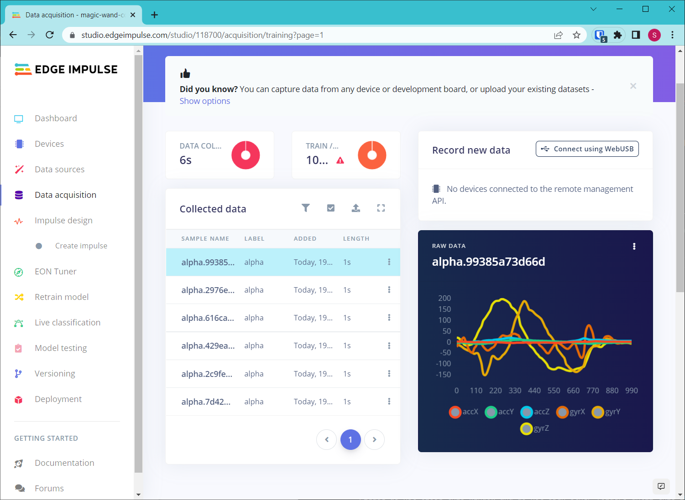

# CSV Data Collection Example

Collection of data collection examples that store raw data samples as comma-separated values (CSV) files to be uploaded to [Edge Impulse](https://edgeimpulse.com/).

For custom sensor and custom board data collection, the [data forwarder](https://docs.edgeimpulse.com/docs/edge-impulse-cli/cli-data-forwarder) is likely the easiest method. However, if you require the ability to trigger collection via hardware (e.g. physical button) or do not have a USB connection, the data forwarder will not work. Use the examples in this repository as a starting point for collecting data in .csv files.

## CSV Format

Edge Impulse requires CSV data to be stored in a particular format. See [this guide](https://docs.edgeimpulse.com/reference/data-ingestion/importing-csv-data) for more information.

For multi-axis, time-series data, the first column **must** be the timestamp (in milliseconds). You will get an error in Edge Impulse if you do not have the timestamp column. Each row should be a single reading at a particular time. For example (from an accelerometer):

```
timestamp,accX,accY,accZ
0,4.220828473773600,1.8800472920291100,-16.89228981323240
16,4.471770735278730,2.0017025177553300,-17.887080018505500
32,4.31928972478658,2.4953566802978500,-18.926163539013300
48,4.648792312787470,2.958335718591510,-18.5336641043514
64,4.773739711926880,2.719663740594690,-18.800019623565700
80,4.653879991315310,2.6865938301637800,-19.98305510341230
```

If you have a single, multi-axis reading that is not a time series, you can omit the timestamp. Here is an example from a single triple-axis accelerometer:

```
accX,accY,accZ
4.220828473773600,1.8800472920291100,-16.89228981323240
```

## CSV Filename

Your CSV files can be named any way you like. You can always adjust labels in the Edge Impulse Studio. However, if you would like the Studio to automatically read the label, you can prepend the label to the front of the filename. For example:

```
<label>.<unique-id>.csv
```

## Getting Started

This example will walk you through collecting CSV accelerometer and gyroscope data from an Arduino Nano 33 BLE Sense whenever a physical button is pressed.

Connect a pushbutton to pin 2 of the Nano 33 BLE Sense. Connect the other side of the pushbutton to GND.

Upload *arduino-examples/nano33_accel_gyro_data_collection* to the Nano 33 BLE Sense.

Make sure you have Python 3 installed (e.g. Python 3.5+).

Install the following third-party Python packages:

```
python -m pip install pyserial
```

Run the Python data collection script. Note that you can call the `serial-data-collect-csv.py` script without any arguments to view the available serial ports.

```
python serial-data-collect-csv.py -p <SERIAL PORT> -b 115200 -d wand -l alpha
```

Press the button connected to the Arduino and wave the board around. After 1 second, the raw data will be sent to the Python script, which will write it to a .csv file.


In the Edge Impulse Studio, create a new project. Go to the **Data acquisition** page of your project. Click the **Upload existing data** button. Follow the on-screen directions to upload your CSV files.

Go back to **Data acquisition** to view your data.



## License

Unless otherwise specified, all code is licensed under the [Apache License, Version 2.0](https://www.apache.org/licenses/LICENSE-2.0)
